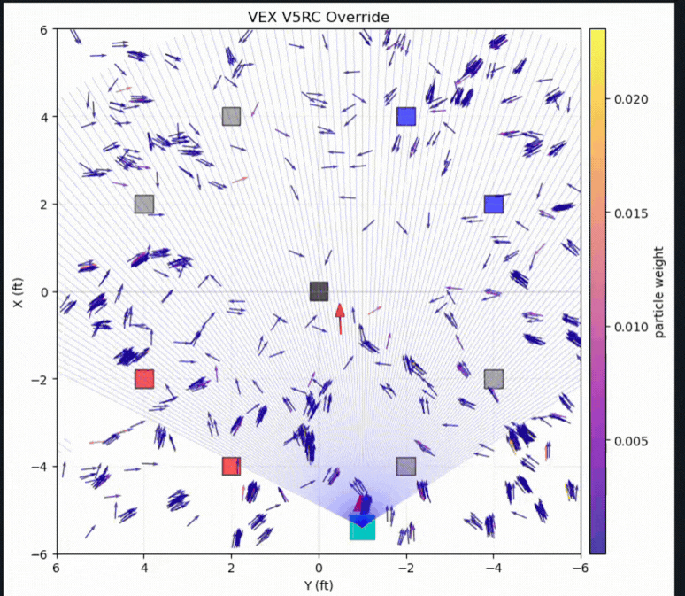

# Visual Localization: VEX Override
Localizing using only relative heading of certain objects proof of concept. Or really localizing with anything but a lidar because why not?

matplotlib notebook/visualizer: main.ipynb

Soon to be made into a [ROS package.](https://github.com/kmhswimgirl/visual_localization) 
